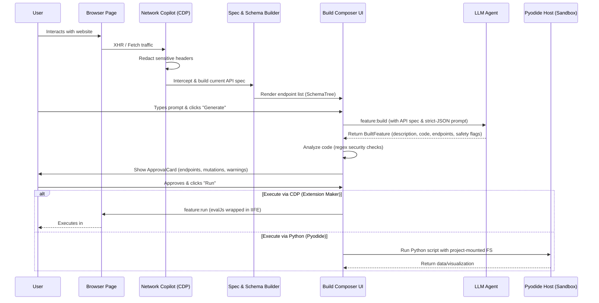

# Blueberry Workbench

# demo

https://github.com/user-attachments/assets/3e8a1269-3260-4178-99db-3088f6e3bd2d

https://github.com/user-attachments/assets/896a79b2-04ca-4151-9508-30b6699f2849

---

## Strawberry Browser Challenge

This project was built as a challenge to get hired by Strawberry Browser, and it is going to be reviewed by the CEO of Strawberry Browser. It would be amazing if Strawberry Browser could have this feature natively!

Think of it as **Tampermonkey on steroids that builds extensions on-the-go**.

## The Main Focus: Universal Extension Maker
An Electron browser that's also an AI workbench — a transparent **Computer-Use** mission control, a per-project **Code Interpreter** (Pyodide), a **Network Copilot**, smart **Downloads** routing, and **per-site memory**. Built on top of the [`dendrite-systems/blueberry-browser`](https://github.com/dendrite-systems/blueberry-browser) baseline.

**Note:** The main focus of this project was the Universal Extension Maker that is shown in the demo above. The other features mentioned below might work but they are experimental and need more work.

## End-to-End Architecture (Extension Maker & Pyodide)

## What's in here

| Area | Where |
|---|---|
| **Computer-Use** agent loop (Plan → Act → Observe) over Chrome DevTools Protocol | `src/main/agent/`, `src/main/cdp/` |
| **Mission Control** UI with rationale, before/after screenshots, approval gates | `src/renderer/sidebar/src/workbench/components/MissionControl.tsx` |
| **Pyodide** in-renderer Python (pandas, numpy, matplotlib) with project-mounted FS | `src/main/code/pyodide-host.ts`, `resources/pyodide-host/` |
| **Network Copilot** — captures every XHR/fetch, can explain, generate snippets, replay GET, extract to CSV | `src/main/cdp/network.ts`, `src/main/cdp/copilot.ts` |
| **Smart Downloads** — `will-download` interceptor routes files into the active project sandbox | `src/main/downloads/router.ts` |
| **Per-site memory** — agent proposes memory updates after each successful run | `src/main/memory/`, `MemoryPanel.tsx` |
| **ProjectStore** (SQLite + sandbox FS) | `src/main/projects/` |
| Typed IPC contract used end-to-end | `src/common/`, `src/main/ipc/handlers.ts`, `src/preload/sidebar.ts` |

